### Git push

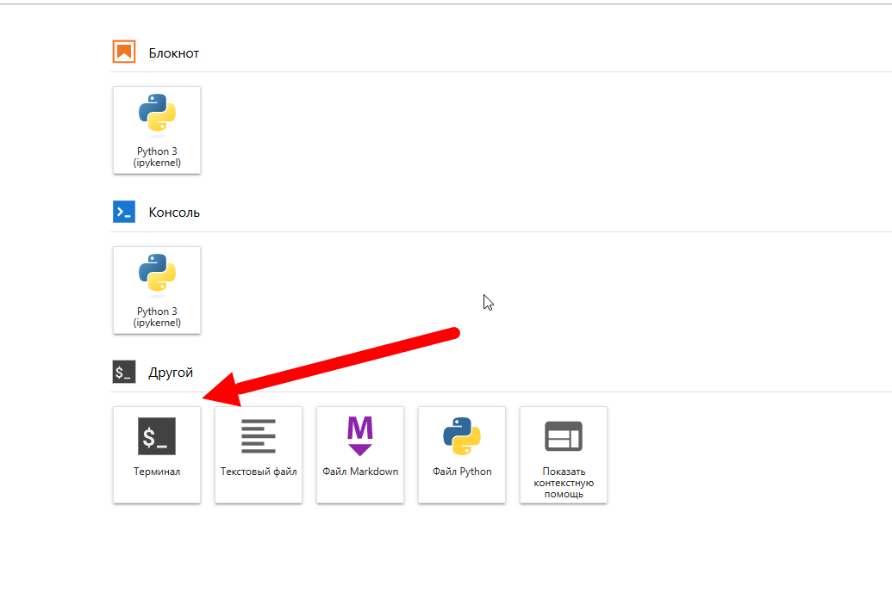

Заходим в терминал и выполняем команды:

Информация о версии
```
git --version
```
Смотрим что в текущей директории
```
ls -la
```
Понимаем, что нам это не нужно и переходим в рабочую директорию ноутбука юпитера, где хранятся наши файлы
```
cd /home/jovyan/work/
```
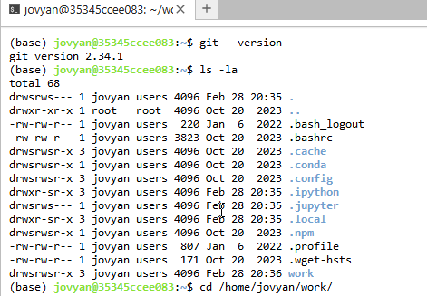
```
git init

git add .
```
Если первый раз, то может потребовать внести учетные данные
```
git config --global user.email "[hek1412@gmail.com](mailto:hek1412@gmail.com)"

git config --global user.name "hek1412"
```
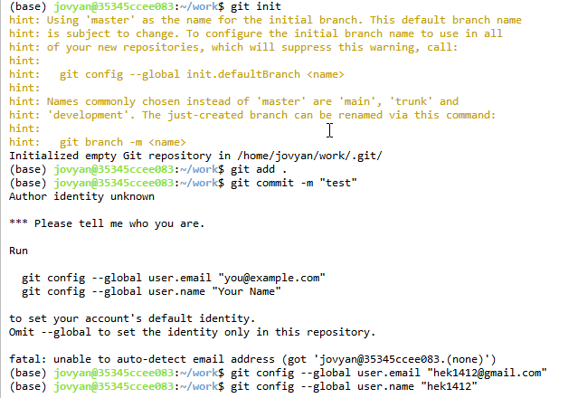


Делаем коммит
```
git commit -m "test"
```

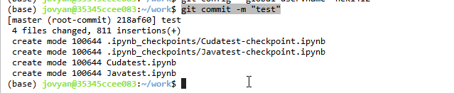

Создаем новый репозиторий в организации 1Т45, я создал testjupyter

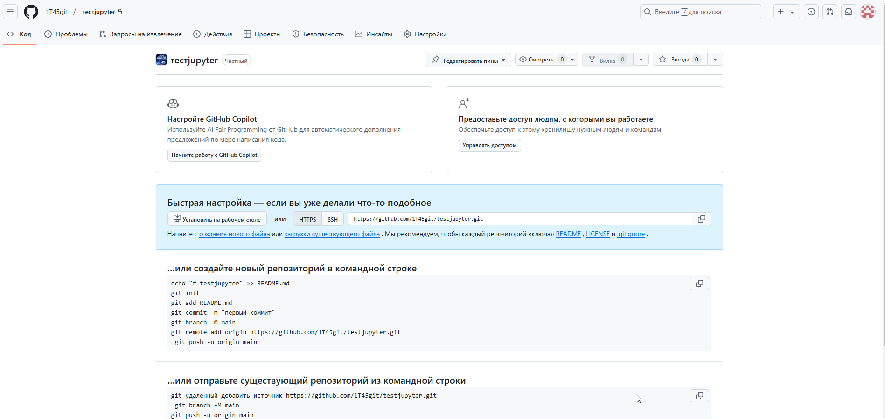

[https://github.com/1T45git/testjupyter](https://github.com/1T45git/testjupyter)

Копируем ссылку на репозиторий

[https://github.com/1T45git/testjupyter.git](https://github.com/1T45git/testjupyter.git)


Далее вводим команды в терминале
```
git remote add origin https://github.com/1T45git/testjupyter.git
```

Проверяем, что новый удаленный репозиторий добавлен
```
git remote -v
```
Выбираем ветку и пушимся
```
git branch -M main

git push -u origin main
```
Далее вводим свой логин Git hub, пароль пока не трогаем.

мой username: hek1412

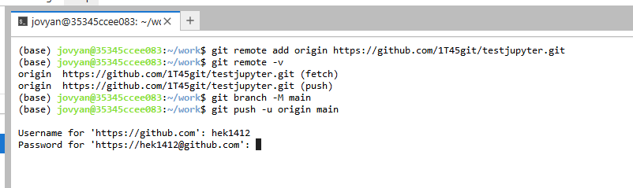

И вот тут самое интересное)

Заходим в свой Git где Ваши репозитории, не организации 1Т45 

Делаем все как на картинках для создания персонального токена доступа (классические)

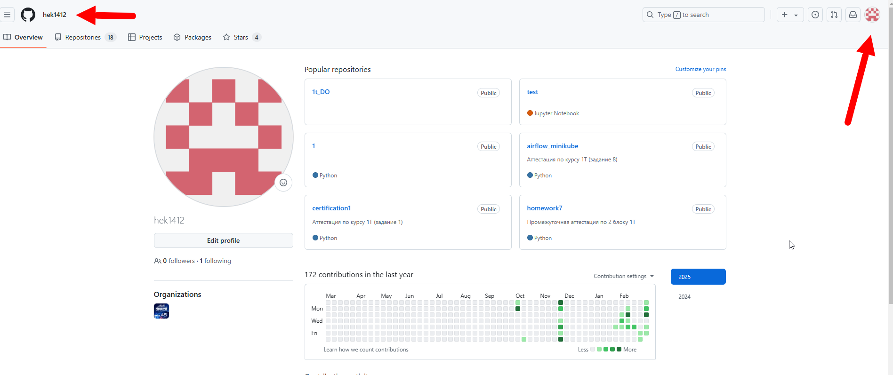

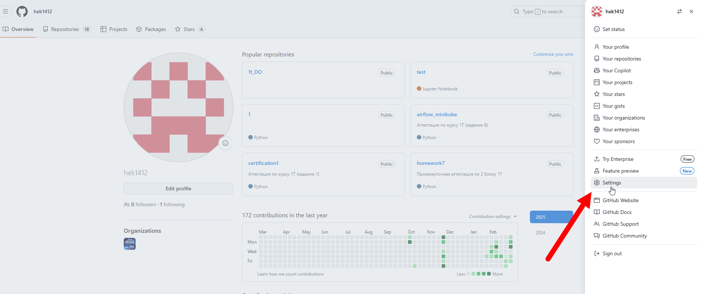


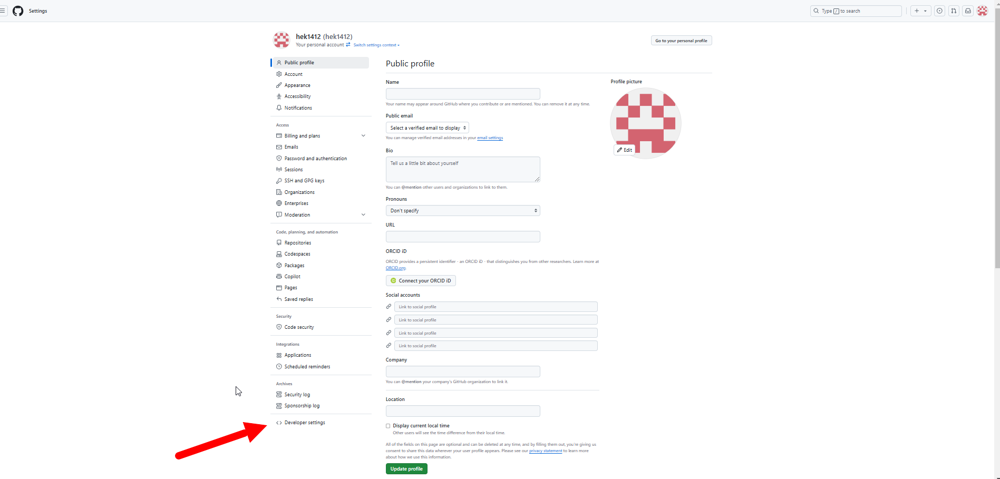


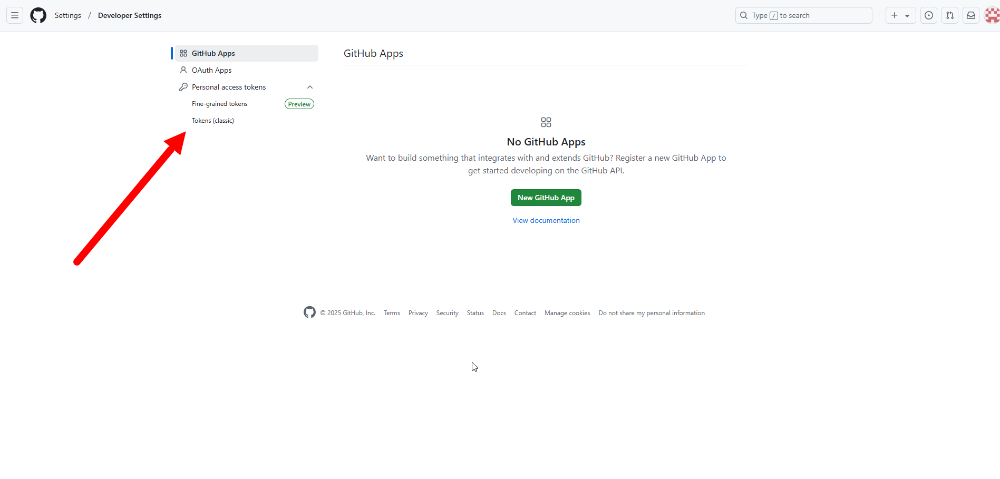


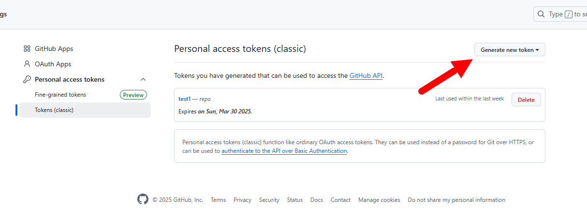


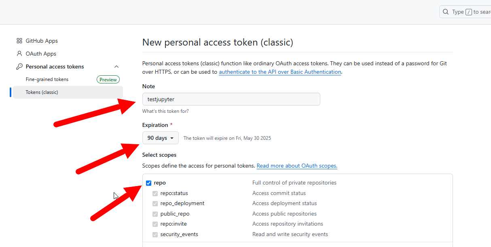


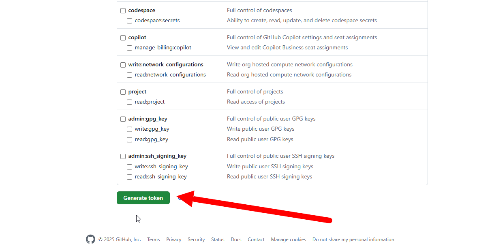

Теперь сохраняем токен у себя, если забудете или потеряете, то нужно будет создать по новой

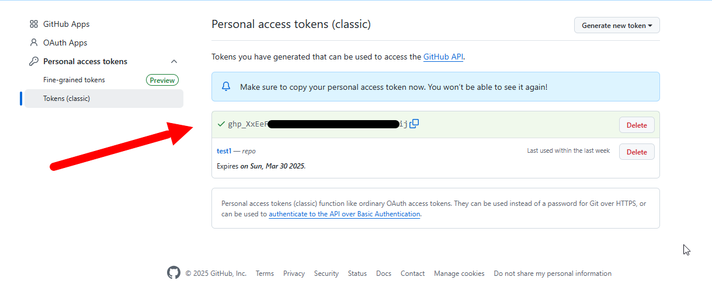

Возвращаемся в терминал и вводим токен в поле для пароля!
Если Вы создали новый репозиторий, то все должно уже быть в Git hub


Проверяем

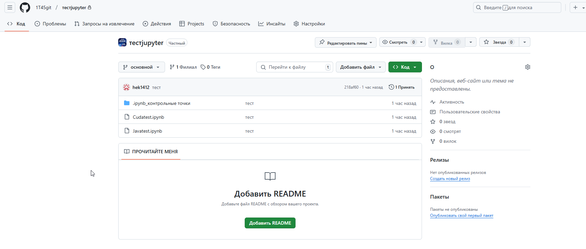


###Клонирование (если репозиторий уже создан и там лежат нужные для работы файлы)

Тут получаем ссылку на репозиторий и вводим в терминале

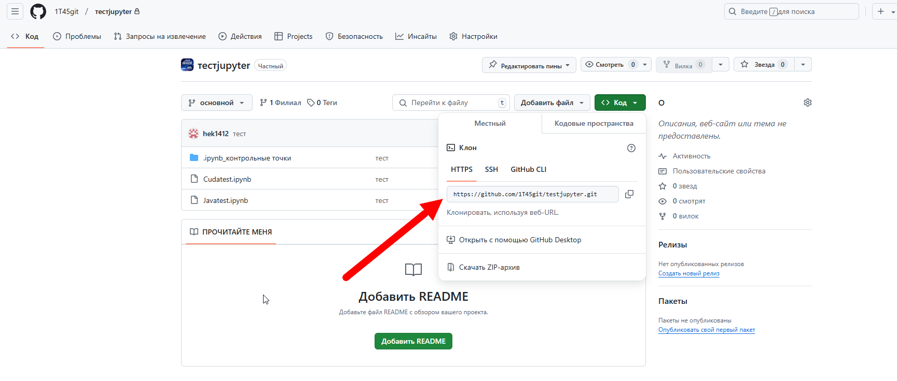

В другом блокноте (например у себя дома) в терминале вводим
```
git clone [https://github.com/1T45git/testjupyter.git](https://github.com/1T45git/testjupyter.git)
```
 Вводим имя и тот пароль который мы сохранили

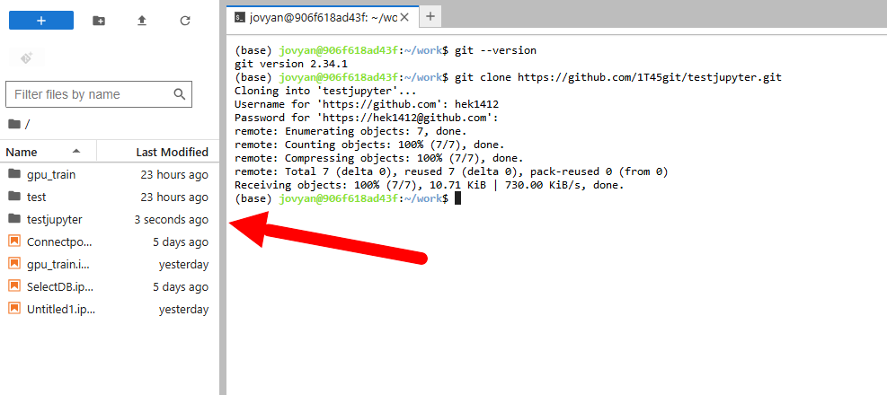

Слева появилась наша папка из репозитория, можем ей пользоваться, делать коммиты и пушить обратно)


